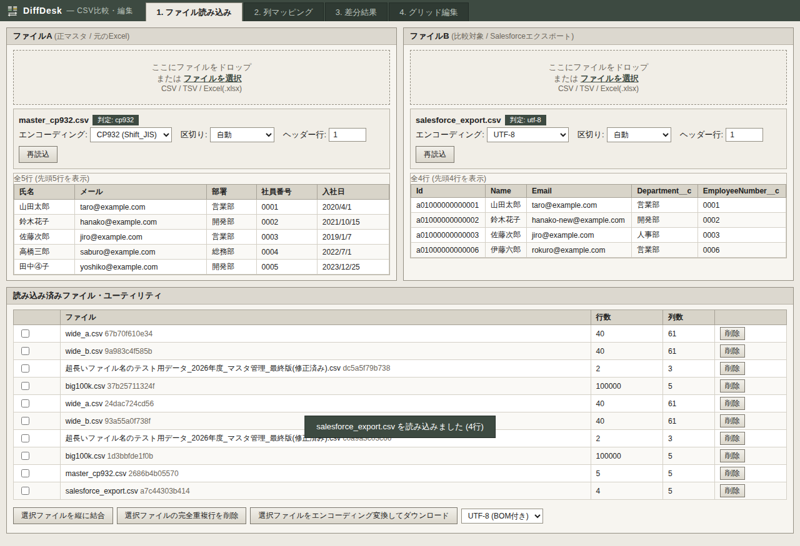
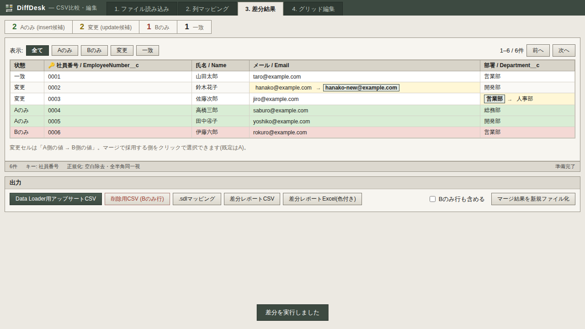
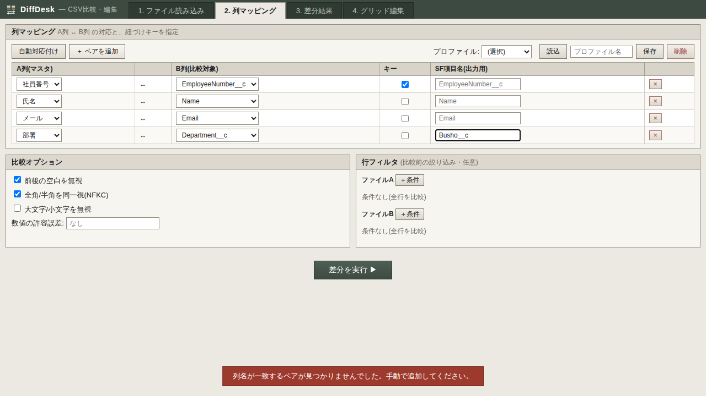
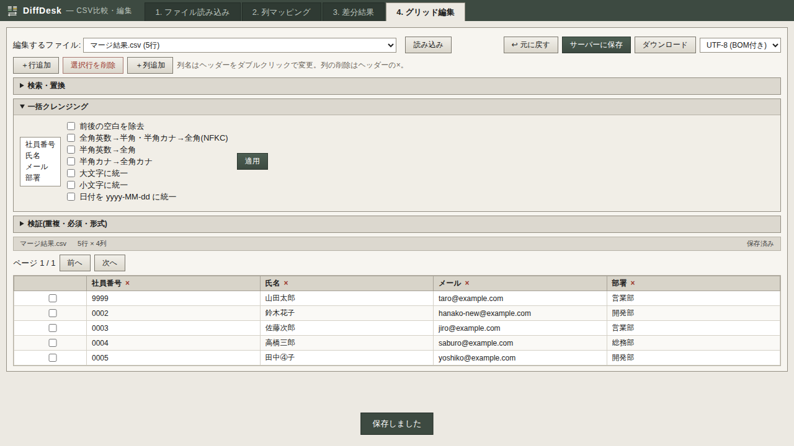

<p align="center"></p>

# DiffDesk

**ヘッダーが異なる2つの表データを、任意の列マッピングで紐づけて突き合わせるローカルツール**です。
たとえば「元のExcelマスタ」と「Salesforceからエクスポートした CSV」を比較して差分を洗い出し、
そのまま **Salesforce Data Loader 用のアップサート/削除CSV** を生成できます。
CSVの編集・整形(グリッド編集・クレンジング・検証)もこれ1つで完結します。

- **完全ローカル動作** — データが外部に送信されることはありません(LLM等も不使用)
- **日本語データに強い** — CP932/UTF-8の自動判定、全角半角の同一視、先頭ゼロ(0001等)を壊さない設計
- **ロジックは純Python** — Web UIなしでもCLI・自作スクリプトから同じ機能を利用可能
- **1万〜10万行でも実用速度**(下記ベンチマーク参照)

---

## 画面

| 1. ファイル読み込み | 3. 照合結果 |
|---|---|
|  |  |

| 2. 紐づけ設定 | 4. 編集・整形 |
|---|---|
|  |  |

## 主な機能

| 分類 | 機能 |
|---|---|
| 読み込み | CSV / TSV / Excel(.xlsx)を**何個でも読み込んで**基準(A)・比較(B)を選択。エンコーディング自動判定(UTF-8 / BOM付き / CP932)+手動上書き、区切り文字自動判定、シート選択、ヘッダー行位置指定 |
| 比較 | 任意の列マッピング(ヘッダー名が違ってもOK)、複合キー、**キーなし比較**(行番号順 / 行の内容一致)、Aのみ/Bのみ/変更/一致の分類、キー重複・空キー警告、正規化オプション(空白・全半角・大小文字・**数値表記の同一視** 1551=1551.0・許容誤差)、行フィルタ |
| 照合ワークフロー | **エディタ風の左右分割表示**、**●ドラッグでの手動紐づけ**(一致率プレビュー+確認付き。「未対応」フィルタで行数が多くても紐づけしやすい**紐づけモード**)、**紐づけ候補の自動提案+しきい値付き一括承認**(100〜60%)、**既知差分**(セル単位 / 欠落行 / 値ルールで全行一括)、差分ジャンプ(n/pキー)、照合履歴、**別ウィンドウの見比べビューア** |
| Web版AI連携 | 未対応行の紐づけ判断を**コピペで**Web版AI(Gemini等)に依頼できるプロンプト生成+回答取り込み。**DiffDesk自体はAIに接続しません** |
| 多対多検証 | 中間(ジャンクション)オブジェクトの投入検証: 複合キーの組み立てルール(`{A}-{B}` テンプレート・自動推定)、親A/親B照合、孤児レコードの原因分析、関係ビュー |
| 移行定義JSON | 移行仕様JSON(fields / valueMap / truthyValues / normalizeRules / composite)を読み込み、**投入時の変換を再現して照合**(変換後の値同士で比較) |
| Salesforce | アップサートCSV(insert+update、外部ID、SF項目名変換、親参照 `Account:ExtId__c`)、削除用CSV、.sdl マッピング出力。**API接続はせずCSV生成のみ** |
| 投入後サポート | 投入検証(件数照合+✔/✖判定)、Data Loaderエラーファイル分析(失敗理由の日本語集計+再投入CSV)、投入ロールバックキット |
| 予防・監視 | ファイル健康診断(列プロファイル+「いつもと違う」検知)、フォルダ監視(`diffdesk watch`) |
| 編集 | グリッド編集(セル・行列・ソート・フィルタ・undo)、検索置換(正規表現)、一括クレンジング(空白・全半角・日付統一・数値表記ほか)、表記ゆれ検出→一括統一、検証(重複・必須・形式・許可値・範囲)、あいまい突合、クロス集計、列付加/分割、匿名化、結合、文字コード変換、差分マージ |
| 出力 | CSV(UTF-8 / BOM付き / CP932、CRLF)、Excel、色付きExcel差分レポート、**リッチな共有用HTMLレポート**(単一ファイル・フィルタ内蔵)。レポート名は「照合レポート_A_vs_B_日時」の形式で自動命名 |
| 案件・再利用 | **案件切替**(既知差分・履歴・手動紐づけ・辞書を案件ごとに保存)、**統一アンドゥ**(直近30操作)、プロファイル保存/読込、ユーザー辞書(列対応の学習)、**更新チェック**(新版公開をヘッダーに表示) |

## インストール

Python 3.10 以上が必要です。

### かんたんインストール(GitHubから直接)

```bash
pip install "diffdesk @ git+https://github.com/cfn0eft/DiffDesk.git"
diffdesk   # ← これだけで起動(ブラウザが自動で開きます)
```

更新も同じコマンドに `--upgrade` を付けるだけです:

```bash
python -m pip install --upgrade "diffdesk @ git+https://github.com/cfn0eft/DiffDesk.git"
```

特定バージョンに固定・巻き戻したい場合は[Releases](https://github.com/cfn0eft/DiffDesk/releases)のタグを付けます:
`pip install "diffdesk @ git+https://github.com/cfn0eft/DiffDesk.git@v0.15.0"`

### 厳格インストール(ハッシュ検証付き)

依存を全バージョン固定+SHA256検証付きで導入します(改ざんされた配布物はインストールに失敗します):

```bash
git clone https://github.com/cfn0eft/DiffDesk.git && cd DiffDesk
pip install --require-hashes --only-binary :all: -r requirements.txt
pip install --no-deps -e .

# 開発(テスト実行)する場合は追加で
pip install --require-hashes --only-binary :all: -r requirements-dev.txt
```

依存は openpyxl / charset-normalizer / fastapi / uvicorn / python-multipart のみ(いずれも著名パッケージ)。
フロントエンドは自作・同梱で、CDN等の外部読み込みは一切ありません。

## 使い方 — 月次のSalesforce照合を例に

```bash
diffdesk          # または python -m diffdesk (既定: http://127.0.0.1:8765、--port で変更可)
```

1. **ファイル読み込み** — 正マスタ(Excel/CSV)とSalesforceエクスポートCSVをドロップ(最初の2つは自動でA/Bに割当)。
   文字化けしていたら「読込設定」からエンコーディングを選び直し
2. **紐づけ設定** — 「自動対応付け」で列を対応付け、紐づけキーにチェック(例: `社員番号 ↔ EmployeeNumber__c`)。
   キーになる列がないファイルは**キー方式**を「行番号で比較」「行の内容で比較」に切り替え。
   設定は**プロファイル保存**しておくと翌月は読み込むだけ
3. **照合結果** — サマリー・変更セルの `旧→新` ハイライトを確認。
   - キーが違うレコード同士は**左右分割+「未対応」フィルタ**で●をドラッグして手動紐づけ
   - 問題ない差異は「**既知にする**」(1セル / この行 / 値ルールで全行)で容認 → 以後の照合はOK扱い
   - 「**Data Loader用アップサートCSV**」「.sdl」「削除用CSV」を出力
4. **編集・整形** — 取り込み前の手直し・クレンジング・検証。編集後にCSV/Excelでダウンロード
5. **多対多検証** — 中間オブジェクト(例: 症例×検査項目)の投入検証はこちら

### 案件の切り替えと元に戻す

- 画面上部の**案件**セレクトで案件(プロジェクト)を切り替えると、既知差分・照合履歴・手動紐づけ・ユーザー辞書がその案件専用になります(「＋新規」で作成。既定案件のデータは従来のまま)
- **↩ 元に戻す**で、既知差分・手動紐づけ・辞書の直前の登録/削除を取り消せます(直近30操作)

### CLI(バッチ・定期実行向け)

```bash
# 差分サマリー+色付きExcelレポート
diffdesk diff master.xlsx sf_export.csv --profile 月次照合 --xlsx report.xlsx

# アップサートCSV+削除CSV+.sdl を一括生成
diffdesk upsert master.xlsx sf_export.csv --profile 月次照合 \
    --out upsert.csv --delete-out delete.csv --sdl mapping.sdl

# 文字コード変換 / 検証 / 結合
diffdesk convert in.csv --out out.csv --out-encoding cp932
diffdesk validate in.csv --keys 社員番号 --required 氏名 --format メール=email
diffdesk concat 4月.csv 5月.csv 6月.csv --out 上期.csv
```

`diffdesk diff --check` は差分があると終了コード1を返すので、定期ジョブでの検知にも使えます。

### プロファイル(マッピング定義)

Web画面で作成・保存するのが簡単です(`~/.diffdesk/profiles/*.json`)。JSONを直接書く場合の例:

```json
{
  "version": 1,
  "name": "月次照合",
  "mapping": { "key_mode": "columns", "pairs": [
    { "col_a": "社員番号", "col_b": "EmployeeNumber__c", "is_key": true },
    { "col_a": "氏名",     "col_b": "Name" },
    { "col_a": "部署",     "col_b": "Department__c", "sf_field": "Busho__c" }
  ]},
  "options": { "trim": true, "normalize_width": true, "normalize_numeric": true },
  "external_id": "社員番号"
}
```

## コアロジックをスクリプトから使う

```python
from pathlib import Path
from diffdesk.core import (
    ColumnPair, MappingConfig, load_table, diff_tables, build_upsert_table, write_csv,
)

a = load_table(Path("master.xlsx").read_bytes(), "master.xlsx")
b = load_table(Path("sf.csv").read_bytes(), "sf.csv")
mapping = MappingConfig(pairs=[
    ColumnPair("社員番号", "EmployeeNumber__c", is_key=True),
    ColumnPair("氏名", "Name"),
])
result = diff_tables(a, b, mapping)
print(result.summary)   # {'only_a': …, 'only_b': …, 'changed': …, 'same': …, …}
upsert = build_upsert_table(result, external_id_col_a="社員番号")
Path("upsert.csv").write_bytes(write_csv(upsert))  # UTF-8 BOM付き・CRLF
```

## 性能(実測)

10万行 × 5列(変更5%)、v0.18.0での実測値:

| 処理 | 10万行 |
|---|---|
| 読み込み(エンコーディング判定込み) | 0.4秒 |
| 差分実行(キー結合) | 2.4秒 |
| 差分実行(キーなし・行番号) | 1.6秒 |
| 差分行のページ取得(200行) | 0.02秒 |
| 共有用HTMLレポート生成 | 0.5秒(7.3MB) |
| 照合レポートCSV | 0.8秒(10.8MB) |
| 検証パック(zip一式) | 2.3秒(2.3MB) |
| セッション保存 / 復元 | 0.4秒 / 1.9秒 |

差分エンジンはキー辞書結合の O(n+m) で、行数にほぼ比例します。アップロード上限は100MBです。

## よくある質問

**Q. プレビューが文字化けする**
自動判定が外れています。「読込設定」からエンコーディング(CP932 / UTF-8等)を選び直してください。プレビューが直れば正しい判定です。

**Q. 1551 と 1551.0 が差異になる / ならないようにしたい**
既定で数値表記は同一視します(1551 = 1551.0 = 1,551)。厳密に区別したい場合は比較オプションの「数値同一視」を外してください。

**Q. キーになる列がない**
紐づけ設定の「キー方式」を「行番号で比較」(並び順が同じ場合)か「行の内容で比較」(同じ行があるかだけ確認)にすると、キーなしで照合できます。

**Q. CP932で保存しようとするとエラーになる**
CP932で表現できない文字(例: 𩸽)が含まれています。エラーに行・列・文字が表示されるので、該当セルを修正するか、UTF-8(BOM付き)で保存してください。

**Q. Data Loaderに投入するCSVはどの設定が良い?**
既定の **UTF-8(BOM付き)** を推奨します。フィールドマッピングは同時出力される .sdl を読み込めば手作業不要です。

**Q. 削除用CSVは安全?**
「Bのみに存在する行のId」を出すだけで、このツールがSalesforceに直接触れることはありません。ただしData Loaderでの削除は取り消せないため、投入前に必ず内容を確認してください。

**Q. キー重複の警告が出た**
同じキー値の行が複数あると正しく突き合わせできないため、該当行は照合から除外して件数を表示しています。単体ファイル検証(編集・整形タブ)で重複行を特定できます。

**Q. 誤って既知差分や紐づけを登録した**
ヘッダーの「↩ 元に戻す」で直前の操作から順に取り消せます。個別に消す場合は各管理パネルの削除ボタンで。

## 開発

```bash
python -m pytest -q                 # 全テスト
python scripts/make_fixtures.py     # テストフィクスチャ再生成
python scripts/make_requirements.py # 依存ロックファイル再生成
```

構成: `diffdesk/core/`(純Pythonロジック・web非依存をテストで担保)/ `diffdesk/web/`(FastAPI)/
`diffdesk/static/`(フロントエンド、ビルド不要のバニラJS)/ `diffdesk/cli.py`(CLI)。

リリース: mainへのマージで `pyproject.toml` のバージョンに対応するタグとGitHub Releaseが自動作成されます
(`.github/workflows/release.yml`)。

## ライセンス

MIT
